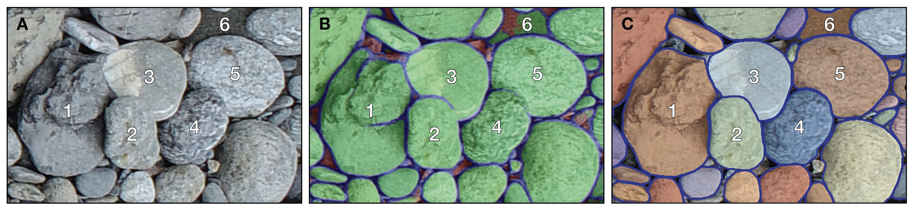
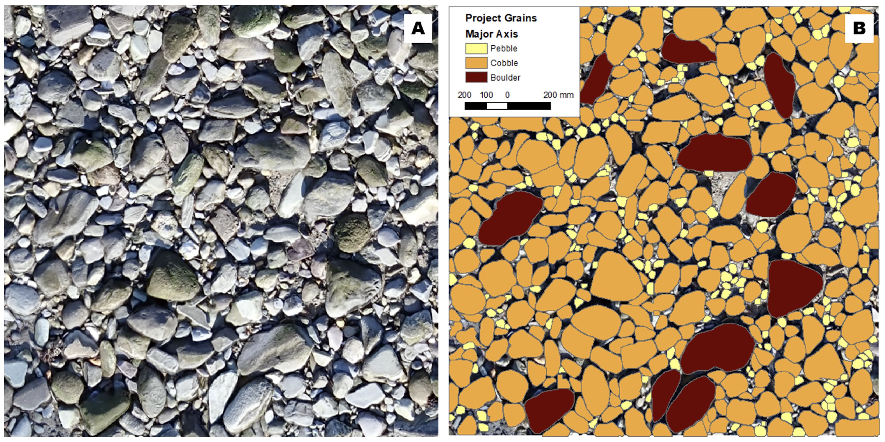

# Summary

`Segmenteverygrain` is a Python module that addresses the need for quantifying grain size in granular materials. It combines the `Segment Anything Model` (SAM) with a U-Net-style convolutional neural network to detect and measure grains or clasts in diverse image types, ranging from photomicrographs of sand, mineral grains, and thin sections to photographic images of gravel and boulder fields. `Segmenteverygrain` supports segmentation of large images, georeferencing, and interactive editing of the results.

# Statement of need

Grain size and shape are key parameters that influence the physical and chemical properties of granular materials. Quantitative estimates of these parameters are important in a number of fields, including:

* geomorphology, sedimentology, stratigraphy, paleontology;
* subsurface reservoir quality;
* structural geology, petrology and geochemistry;
* civil engineering;
* environmental science;
* materials science.

In recent years, numerous studies have illustrated the promise of automated image analysis and/or machine learning (ML) approaches [@Buscombe:2020; @Tang:2020; @Mair:2022; @Chen:2023; @Prieur:2023; @Mair:2024; @Azzam:2024]. While these studies clearly show that ML techniques are superior to both  manual data collection and conventional image processing techniques [e.g., @Purinton:2021], they focus on a narrow range of image types, e.g., gravel on fluvial bars [@Mair:2022; @Mair:2024], boulder fields on planetary surfaces [@Prieur:2023; @Robin:2024], or petrographic images [@Tang:2020; @Azzam:2024].

With the emergence of large image segmentation models trained on millions of images [e.g., @Kirillov:2023; @Ravi:2024], the opportunity arises to use these models to detect a variety of grains in a broad range of image types. `Segmenteverygrain` is a Python module that takes advantage of the Segment Anything Model (SAM) [@Kirillov:2023] and uses a U-Net-style convolutional neural network to create prompts for SAM. It ensures that the resulting masks contain no duplicates and do not overlap. In general, SAM masks are more robust and accurate than the U-Net output (\autoref{fig:1}). The U-Net model uses patches as input and output; to reduce edge effects, Hann-window-based weighting is used on overlapping patches [@Pielawski:2020]. The U-Net model was trained on 66 images of a variety of grains, split into 44,533 patches of 256x256 pixels. When compared to other approaches to grain size data collection, one of the advantages of `Segmenteverygrain` is that it is relatively easy to generate new training data and fine tune the U-Net model to improve the SAM output.

`Segmenteverygrain` has been successfully used on:

* images of boulder fields on asteroids [@Robin:2024];
* photographs of gravel and cobbles on beaches [@Roberts:2024] and fluvial bars (\autoref{fig:2});
* photomicrographs of sandstone (\autoref{fig:3}) and oolitic limestone thin sections;
* photomicrographs of sand and detrital zircon grains.

 

# Key functionality

The U-Net model in the `Segmenteverygrain` repository works relatively well on a variety of image types. However, it is recommended to first test it on a small image. If additional fine tuning is necessary, `Segmenteverygrain` has tools for interactively deleting, merging, and adding grains to generate training data.

The `predict_large_image` function can be used to run the segmentation of larger images that contain thousands of grains. This is done by running the U-Net + SAM predictions on smaller tiles of the input image, and collecting the grains into a list without duplicates.

Grain area, major and minor axis lengths, and a number of other grain features are stored in a dataframe. The distributions of major- and minor grain axis lengths are plotted; they can be weighted by grain areas, so that they are more consistent with grain size distributions that come from sieving, point counting, or Wolman counts [@Taylor:2022].

The `Segment_every_grain_w_georeferencing.ipynb` notebook demonstrates how to run `Segmenteverygrain` on a georeferenced image and save the results as a shapefile. This enables geospatial analyses of the coarse material, capturing variations in grain size across surfaces (\autoref{fig:4}).
 

# Dependencies and availability

The `Segmenteverygrain` package is available from PyPI at [https://pypi.org/project/segmenteverygrain/](https://pypi.org/project/segmenteverygrain/). The dependencies include image processing and shape manipulation tools, such as `Pillow` [@Clark:2015], `scikit-image` [@Van_der_Walt:2014], `rasterio` [@Gillies:2019], and `shapely` [@Gillies:2025]. To identify and manipulate overlapping polygons, we rely on the `networkx` package [@Hagberg:2008]. The U-Net model is built using `tensorflow` [@Abadi:2015] and `keras` [@Chollet:2015]; parts of the ML workflow rely on the `scikit-learn` library [@Pedregosa:2011].

# Acknowledgements

Funding was provided by the Quantitative Clastics Laboratory, Bureau of Economic Geology, The University of Texas at Austin. We are thankful to Jake Covault, Sergey Fomel, and Tim Lawton for discussions.

# References